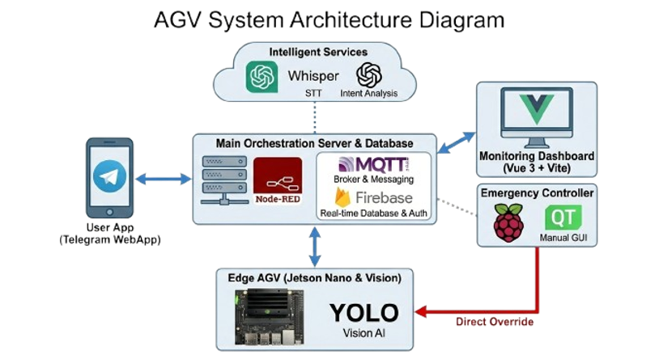

<div align="center">


# 보미

요양보호사의 든든한 AI 로봇 동료

**LLM 및 Digital Twin 기반의 스마트 요양 시설 AGV 솔루션**

자연어 명령 인식부터 일일 업무 자동 리포팅까지, 빈틈없는 올인원 케어

박현성(팀장), 장유진 | 2025.12.10 ~ 2025.12.31 (3주)

<sub><span style="color:gray">EMB &nbsp;·&nbsp; AI &nbsp;·&nbsp; FE &nbsp;·&nbsp; BE</span></sub>

<br/>


[아키텍처](#-3-system-architecture) · [기술 스택](#-4-tech-stack) · [시작하기](#-5-getting-started) · [프로젝트 구조](#-6-project-structure)

<br/>

[](docs/plan.md)
[](docs/protocol_spec.md)
[](docs/troubleshooting.md)
[](execs/porting_manual.md)

</div>

---

## 📑 Table of Contents

1. [Background](#-1-background)
2. [Demo](#-2-demo)
3. [System Architecture](#-3-system-architecture)
4. [Tech Stack](#-4-tech-stack)
5. [Getting Started](#-5-getting-started)
6. [Project Structure](#-6-project-structure)

---

## 🔍 1. Background

요양원에서는 물 전달, 물품 수거 같은 간단한 반복 요청이 하루에도 수십 번 발생하여 요양보호사의 핵심 케어 시간이 줄어들고, 바닥에 방치된 물품으로 낙상 위험이 증가합니다.

| 문제 | 해결 방법 |
|------|-----------|
| 반복 심부름으로 요양보호사 핵심 케어 시간 감소 | AGV가 물 전달, 수거, 정리 등 단순 반복 업무 대행 |
| 버튼 중심 UI의 상황별 명령 표현 한계 | 터치, 텍스트, 음성(Whisper) 멀티모달 명령 입력 지원 |
| 바닥 방치물 및 장애물로 인한 낙상 위험 | YOLOv5s 실시간 객체 감지 → 즉시 정지, 회피 |
| 복잡한 경로(곡선, 교차로) 주행 불안정 | ResNet-18 딥러닝 라인 트레이싱으로 정밀 주행 |
| 원격지 로봇 상태, 진행 상황 파악 어려움 | MQTT 디지털 트윈 + Telegram WebApp 실시간 모니터링 |
| 장애/오류 로그를 운영자가 수동으로 분석 | GPT-5 기반 로그 자동 요약 및 유지보수 인사이트 제공 |

---

## 🎬 2. Demo

<div align="center">

[](https://youtu.be/EvqPIbCBvwE)

</div>

---

## 🏗 3. System Architecture

<div align="center">



</div>

### 동작 시나리오

| 단계 | 동작 | 기술 |
|------|------|------|
| **① 명령 수신** | 버튼, 텍스트, 음성으로 작업 요청 | Whisper(STT) + GPT-4.1 nano(의도 파악) |
| **② 경로 주행** | 디지털 트윈 기반 최적 경로 주행 및 정밀 회전 | ResNet-18, 조향 regression |
| **③ Pick & Place** | 목적지 도착 후 객체 인식 및 로봇팔 제어 | YOLOv5s TFLite (Cup / Doll / Block) |
| **④ 실시간 보고** | 작업 진행 상황 즉시 전달 | Telegram Bot API, MQTT |

### 주요 기능

<div align="center">

</div>

| 기능 | 설명 |
|------|------|
| **멀티모달 명령** | 터치, 텍스트, 음성 3가지 입력 방식 지원, Whisper + GPT-4.1 nano 의도 해석 |
| **자율 주행** | ResNet-18 라인 트레이싱, 곡선, 교차로, 180° 정밀 회전 구현 |
| **온디맨드 리소스 최적화** | 주행 중 웹캠 OFF(ResNet18), 작업 시 웹캠 ON(YOLOv5s) 모드 자동 전환 |
| **Pick & Place** | YOLOv5s 객체 인식(컵, 인형, 블록) 후 로봇팔 파지, 전달, 정리 수행 |
| **디지털 트윈** | MQTT로 로봇 위치, 상태를 Vue3 웹 맵에 0.1초 단위 실시간 동기화 |
| **LLM 운영 브리핑** | GPT-5가 Firestore 로그 분석 → 이상 징후, 원인 후보, 조치 순서 제안 |
| **실시간 모니터링** | 배터리 전압, 적재 여부, 센서 데이터, 에러를 실시간 로깅 |

---

## 🧰 4. Tech Stack

| 영역 | 기술 |
|------|------|
| **Robot AI (Edge)** |    ResNet-18, YOLOv5s TFLite |
| **HMI (디스플레이)** |   pyqtgraph, paho-mqtt, firebase-admin |
| **AI / LLM API** |    |
| **Orchestration** |    |
| **Web Dashboard** |    Axios, Vue Router |
| **알림** |  Telegram WebApp |

### 하드웨어 스펙

| 구분 | 항목 | 상세 사양 |
|------|------|-----------|
| **Main Robot** | AGV 모델 | JetBot v0.4.0 기반 커스텀 플랫폼 |
| **HMI Controller** | 메인 보드 | Raspberry Pi 5 (BCM2712 SoC) |
| **Edge AI** | AI 가속기 | NVIDIA Jetson Nano |
| **Vision** | 카메라 | CSI 카메라(주행용), USB 웹캠(객체인식용) |
| **Mechanics** | 구동부 | DC 모터 + 환경 정리용 로봇팔 |
| **Connectivity** | 무선 통신 | Wi-Fi (MQTT) |

---

## 🚀 5. Getting Started

### 사전 요구사항

| 항목 | 버전 |
|------|------|
| Python | 3.10+ |
| Node.js | 20 LTS 이상 (22 권장) |
| Node-RED | 최신 안정 버전 |
| MQTT Broker | Mosquitto |

### 1) MQTT 브로커 & Node-RED 기동

```bash
# Mosquitto 브로커 실행
mosquitto -c /etc/mosquitto/mosquitto.conf

# Node-RED 실행 후 플로우 임포트
node-red
# → http://localhost:1880 접속
# Node_red_flow/flows.json 가져오기(Import)
```

### 2) Web Dashboard 실행

```bash
cd Agv_dashboard

npm install
npm run dev
# → http://localhost:5173
```

### 3) AGV Robot 실행 (Jetson Nano)

```bash
# Jetson에서 주피터 노트북 실행
jupyter notebook Jetson/jetson.ipynb
```

### 4) Qt HMI 실행 (Raspberry Pi 5)

```bash
cd Qt
pip install -r requirements.txt
python tools/compile_ui.py
python mainwindow.py
```

> Firebase 서비스 계정 키(`ssafy_embedded_qt-gui-controller.json`)는 별도 발급 후 `Qt/assets/secrets/` 아래에 배치하세요.
> OpenAI API 키는 Node-RED 환경 변수에 설정하세요.

---

## 📂 6. Project Structure

```text
AGV_Project/
├── Agv_dashboard/            # 웹 관제 대시보드 (Vue 3 + Vite)
│   └── src/
│       ├── components/       # AlertsPanel, DigitalTwinSection, MiniMap, KpiStrip 등
│       ├── views/            # Home, Robots, Tasks, Events, Interaction 화면
│       ├── stores/           # Pinia 상태 관리
│       ├── router/           # Vue Router 설정
│       ├── api/              # REST 연동 (agv.js)
│       ├── config/           # mapConfig.js 등 환경 설정
│       └── assets/           # CSS 등 정적 리소스
│
├── Qt/                       # 현장 HMI (PySide6, Raspberry Pi 5)
│   ├── pages/                # overview, map, tasks, logs, control, analytics
│   ├── utils/                # mqtt_client, firestore_client, yolo_tflite_worker,
│   │                         # camera_worker, map_view, plot_theme 등
│   ├── models/               # best-fp16.tflite (YOLOv5s), data.yaml
│   ├── page_ui/              # Qt Designer .ui + 컴파일된 ui_*.py
│   ├── tools/                # compile_ui.py
│   ├── assets/qss/           # theme_darkblue, theme_darkpink, theme_rosepink
│   └── mainwindow.py
│
├── Jetson/                   # AGV 자율주행 코드 (Jetson Nano)
│   └── jetson.ipynb          # ResNet-18 라인 트레이싱 + 모터 제어 + 로봇팔
│
├── Node_red_flow/            # Node-RED 오케스트레이션
│   ├── flows.json            # 최신 플로우 (LLM 분기, Firebase, API 포함)
│   └── archive/              # 버전별 백업
│
├── Experiments/              # 프로토타입, 실험 노트북
│
├── docs/
│   ├── images/               # 로고, 시스템 아키텍처, 시연 GIF
│   ├── plan.md               # 프로젝트 기획서
│   ├── protocol_spec.md      # MQTT, REST API, Firestore 스키마
│   └── troubleshooting.md    # 트러블슈팅 기록
│
├── execs/
│   └── porting_manual.md
│
└── README.md
```

---

<div align="center">

**스마트 요양시설 AGV 솔루션** | SSAFY 14기 임베디드 트랙 관통 프로젝트

</div>
